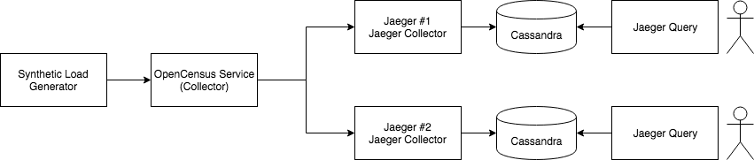

# OpenCensus Service Demo

This is a demo of OpenCensus service showing off some of its capabilities:
- Tail-based sampling of traces
- Sending to multiple destinations
- Buffer and retry
- Operational metrics and logging
- Configuration syntax

For more details about OpenCensus service, refer to the official documentation
[here](https://github.com/census-instrumentation/opencensus-service) or join
the community at [gitter](https://gitter.im/census-instrumentation/Lobby).

## Demo Flow

The figure below describes the "deployment architecture" of the demo:



Here is a description of the components:
- [Synthetic Load Generator](https://github.com/Omnition/synthetic-load-generator) : This is a
  utility that simulates a microservice-based application and generates operational data
  (traces, metrics, logs, events) similar to the application it models.
- [OpenCensus Service Collector](https://github.com/census-instrumentation/opencensus-service) : The
  OpenCensus Service Collector (oc-collector) receives traces from the instrumented application, directly, or via the
  OpenCensus Service Agent (oc-agent). The oc-collector buffers the traces in-memory with
  configurable per-target queues and retry behavior. It performs tail-based sampling on entire
  traces with custom policy per target.
- [Jaeger](https://www.jaegertracing.io/) is an open-source distributed tracing backend.

## Running the Demo

You must have Docker and Compose installed in your machine. Please refer to the [documentation](https://docs.docker.com/compose/)
for details on how to do that.

You can run the demo with a simple command:
```
docker-compose -f ./docker-compose/demo.yaml up
```

This will start up all the needed components.

Stop the demo using:

```
docker-compose -f ./docker-compose/demo.yaml down
```


